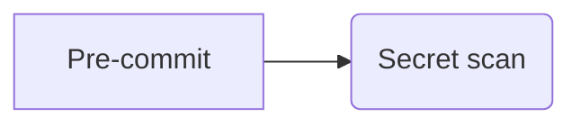
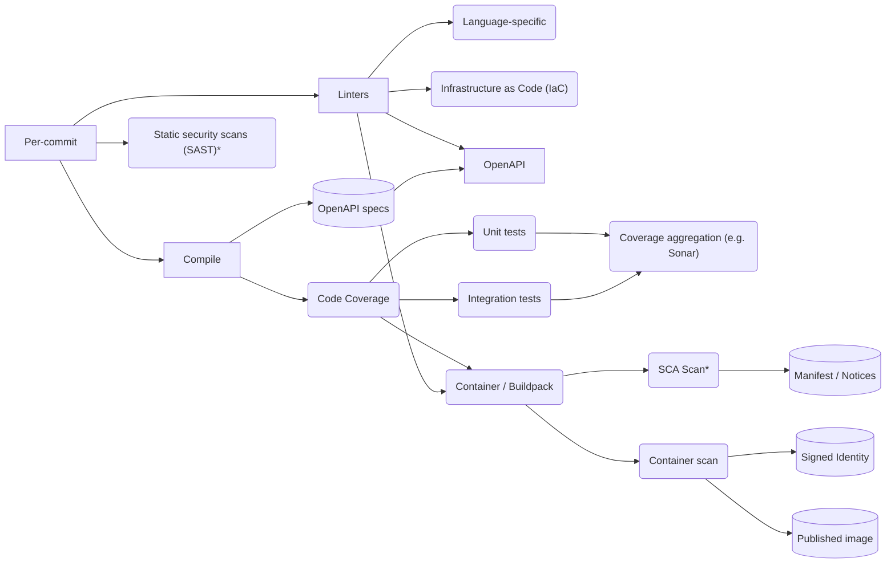
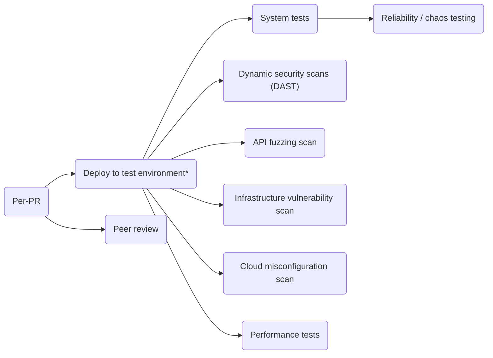
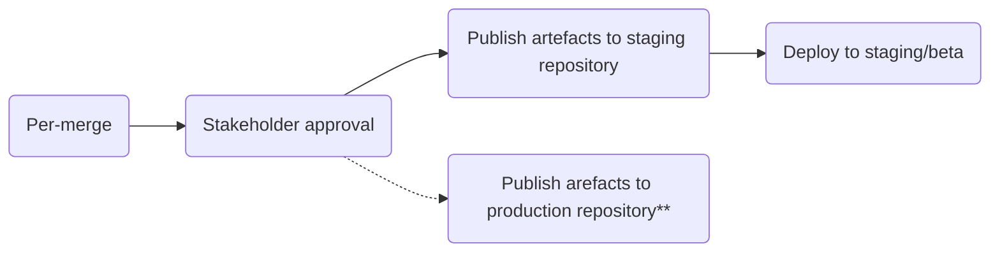

# Build

## Notes

- Each operation is performed in an immutable container with provenance and signed attestation of all generated artifacts
- Each branch is a step that should be performed in parallel
- The build should fail if any attestation fails (leveraging in-toto & SPIRE)

\* indicates that this could happen at a different frequency based upon compute/cost/risk tradeoffs; the minimum frequency is that these steps must be completed before the PR may be merged

## Pre-commit

## Per-commit

## Per-pull request (or per update to PR)

## Per-merge

\*\* Publication/promotion to production upon stakeholder approval depends upon risk tolerance

## Per-deployment

TODO

## Pipeline/build provisioning

TODO
