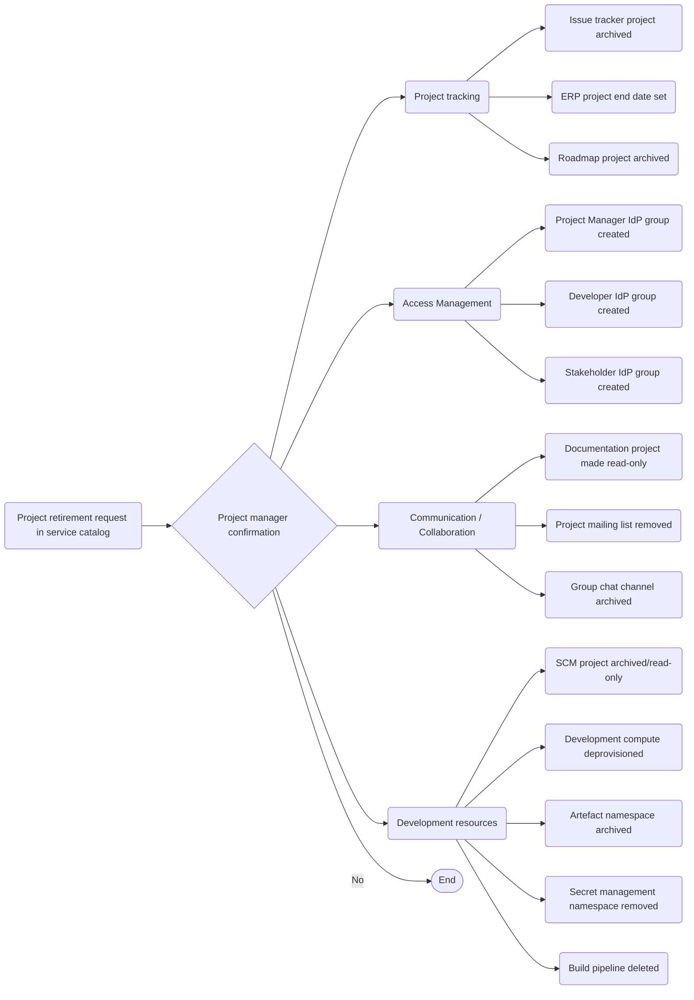
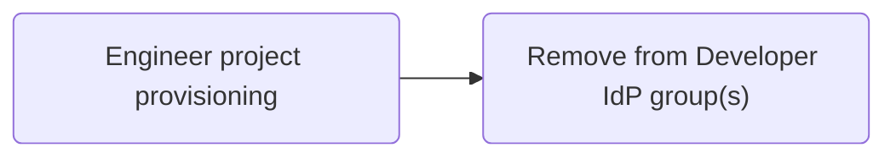

# Provisioning

## Project deprovisioning

```mermaid
graph LR
  Init(Project retirement request in service catalog) --> Confirmation{Project manager confirmation}
  Confirmation --> ProjectTracking(Project tracking)
  ProjectTracking --> IssueTracker(Issue tracker project archived)
  ProjectTracking --> ERPProject(ERP project end date set)
  ProjectTracking --> Roadmap(Roadmap project archived)
  Confirmation --> AccessManagement(Access Management)
  AccessManagement --> ProjectManagerIdp(Project Manager IdP group created)
  AccessManagement --> DevIdp(Developer IdP group created)
  AccessManagement --> StakeholderIdp(Stakeholder IdP group created)
  Confirmation --> Communication(Communication / Collaboration)
  Communication --> Documentation(Documentation project made read-only)
  Communication --> ProjectMailing(Project mailing list removed)
  Communication --> GroupChat(Group chat channel archived)
  Confirmation --> DevResources(Development resources)
  DevResources --> SCM(SCM project archived/read-only)
  DevResources --> Compute(Development compute deprovisioned)
  DevResources --> Artefact("Artefact namespace archived")
  DevResources --> SecretManagement(Secret management namespace removed)
  DevResources --> BuildPipeline(Build pipeline deleted)
  Confirmation --> |No|Reject([End])
```

## Engineer offboarding

### Engineer project offboarding

```mermaid
graph LR
  Engineer(Engineer project provisioning) --> Idp("Remove from Developer IdP group(s)")
```
