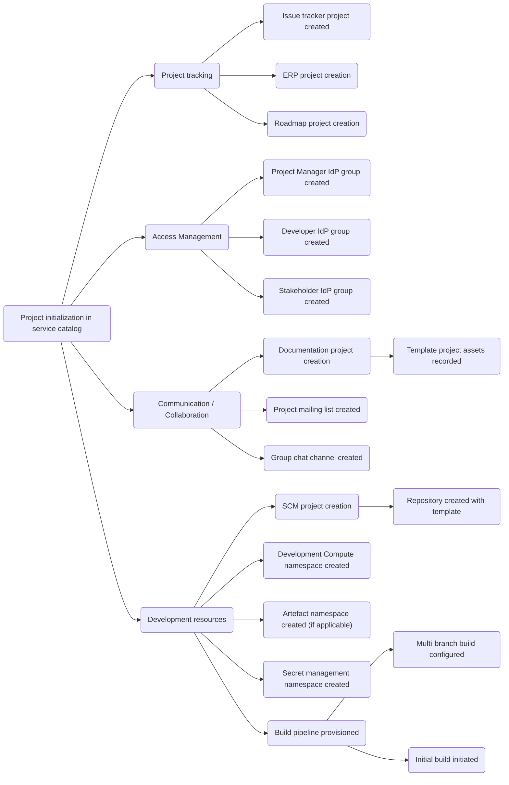
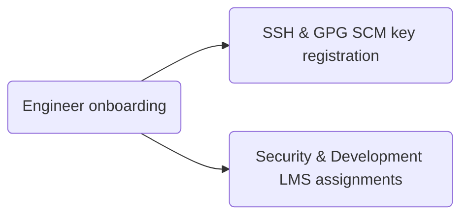
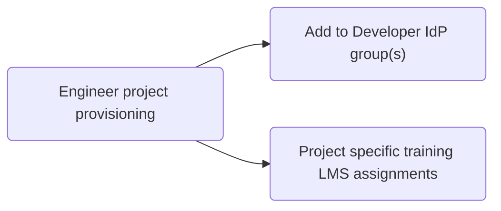

# Provisioning

## Project provisioning

```mermaid
graph LR
  Init(Project initialization in service catalog) --> ProjectTracking(Project tracking)
  ProjectTracking --> IssueTracker(Issue tracker project created)
  ProjectTracking --> ERPProject(ERP project creation)
  ProjectTracking --> Roadmap(Roadmap project creation)
  Init --> AccessManagement(Access Management)
  AccessManagement --> ProjectManagerIdp(Project Manager IdP group created)
  AccessManagement --> DevIdp(Developer IdP group created)
  AccessManagement --> StakeholderIdp(Stakeholder IdP group created)
  Init --> Communication(Communication / Collaboration)
  Communication --> Documentation(Documentation project creation) --> TemplateDoc(Template project assets recorded)
  Communication --> ProjectMailing(Project mailing list created)
  Communication --> GroupChat(Group chat channel created)
  Init --> DevResources(Development resources)
  DevResources --> SCM(SCM project creation) --> RepoTemplate(Repository created with template)
  DevResources --> Compute(Development Compute namespace created)
  DevResources --> Artefact("Artefact namespace created (if applicable)")
  DevResources --> SecretManagement(Secret management namespace created)
  DevResources --> BuildPipeline(Build pipeline provisioned)
  BuildPipeline --> Multibranch(Multi-branch build configured)
  BuildPipeline --> InitBuild(Initial build initiated)
```

## Engineer onboarding

### Employee onboarding

```mermaid
graph LR
  Onboarding(Engineer onboarding) --> SSH(SSH & GPG SCM key registration)
  Onboarding --> LMS(Security & Development LMS assignments)
```

### Engineer project onboarding

```mermaid
graph LR
  Engineer(Engineer project provisioning) --> Idp("Add to Developer IdP group(s)")
  Engineer --> ProjectLMS(Project specific training LMS assignments)
```
