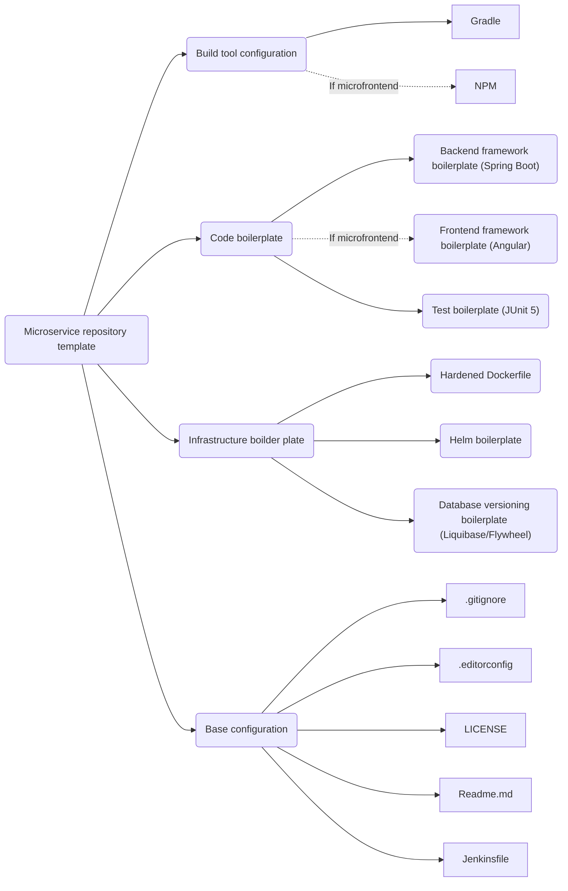
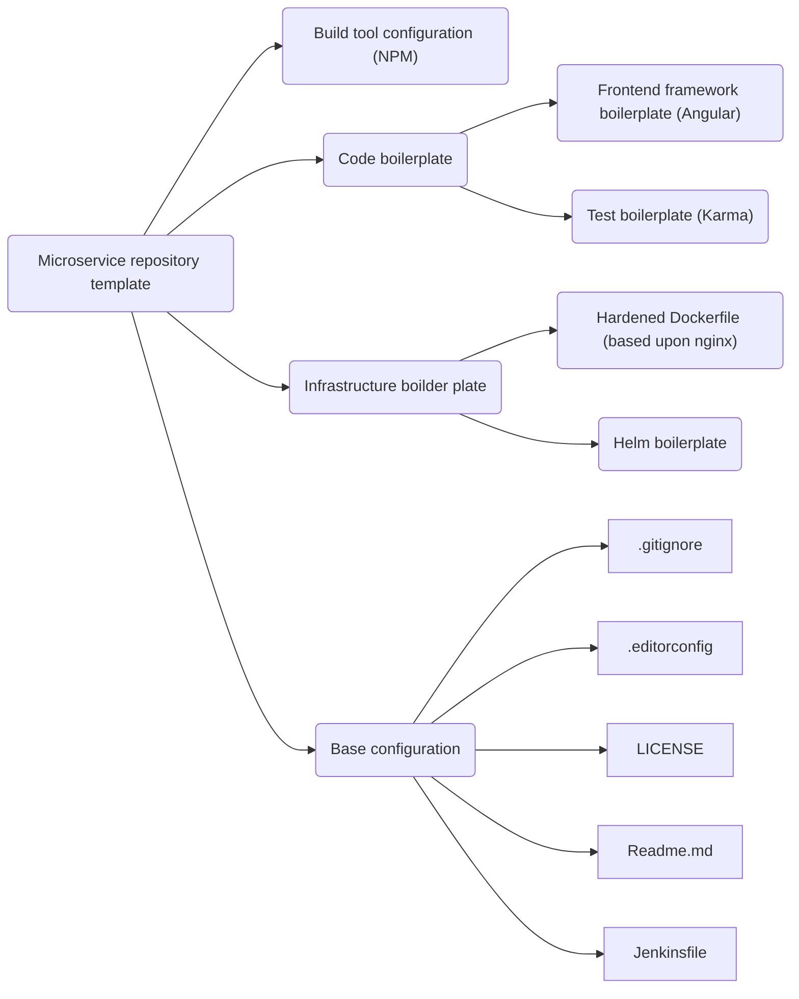

# Repository

## Microservice repository (Backend Java example)

```mermaid
graph LR
  Repo(Microservice repository template) --> BuildTool(Build tool configuration)
  BuildTool --> Gradle
  BuildTool -.-> |If microfrontend|NPM
  Repo --> Code(Code boilerplate)
  Code --> Backend("Backend framework boilerplate (Spring Boot)")
  Code -.-> |If microfrontend|Frontend("Frontend framework boilerplate (Angular)")
  Code --> Test("Test boilerplate (JUnit 5)")
  Repo --> Infra(Infrastructure boilder plate)
  Infra --> Docker(Hardened Dockerfile)
  Infra --> Helm(Helm boilerplate)
  Infra --> Database("Database versioning boilerplate (Liquibase/Flywheel)")
  Repo --> Base(Base configuration)
  Base --> .gitignore
  Base --> .editorconfig
  Base --> LICENSE
  Base --> Readme.md
  Base --> Jenkinsfile
```

## Microfrontend repository (Angular example)

```mermaid
graph LR
  Repo(Microservice repository template) --> BuildTool("Build tool configuration (NPM)")
  Repo --> Code(Code boilerplate)
  Code --> Frontend("Frontend framework boilerplate (Angular)")
  Code --> Test("Test boilerplate (Karma)")
  Repo --> Infra(Infrastructure boilder plate)
  Infra --> Docker("Hardened Dockerfile (based upon nginx)")
  Infra --> Helm(Helm boilerplate)
  Repo --> Base(Base configuration)
  Base --> .gitignore
  Base --> .editorconfig
  Base --> LICENSE
  Base --> Readme.md
  Base --> Jenkinsfile
```
